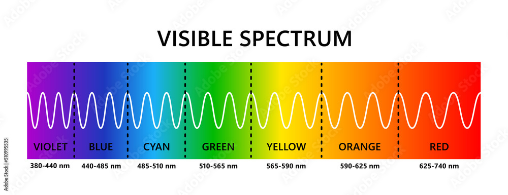

```{r setup, include=FALSE}
knitr::opts_chunk$set(echo = TRUE,
                      eval = FALSE,
                      message=FALSE,
                      error=FALSE,
                      fig.width=12,
                      fig.height=8)
library(webexercises)
```

## Background

In this brief practical, we want to make sure we are all on the same page when it comes to the tidyverse. We are going to use spectrophotometer readings of skin pigmentation of tadpoles to go through some examples of how to use the tidyverse in R to perform data manipulation.

## The Tidyverse

> *Question:* What is the Tidyverse?

`r hide("Show Answer")`


-   [A collection of R packages](https://www.tidyverse.org/)
-   The packages are focused on data science and they share an underlying grammar and design. In other words, they play well together!

`r unhide()`

Efficient data manipulation and visualization becomes increasingly important when working with large datasets. In genomics, we are often working with 10s of thousands or 100s of thousands of lines of data, and often more than one related table or dataframe, that all needs to be manipulated in R.

### Installing and using the tidyverse

```{r}
#install.packages("tidyverse",repos ="https://cran.rstudio.com/")
library(tidyverse)
```

You should see that a call to load `tidyverse` library essentially just loads a number of "core" packages. It also tells you if there are any conflicting functions. For example, if you call `filter()`, it will use the filter function from the `dplyr` package, unless you specify to use the base `stats` package.

### Experimental Background and data loading

As a quick re-cap, we have just finished a pigmentation plasticity experiment with *Pelobates cultripes* tadpoles. We reared a bunch of tadpoles from the same egg clutch (e.g. genetically similar individuals) under standardized laboratory conditions. The only condition we manipulated is whether tadpoles were reared in a black or a white bucket. After 40 or so days of exposure to these conditions, we anesthetized the tadpoles to be able to take photospectrometry measurements of the skin colour on their dorsum and ventrum, and to also a skin sample that we stored in RNAlater for an RNA extraction and gene expression analsis.

The photospetrometry measurements are stored as a comma-separated values table (.csv file), and we have a second file that contains information about what background the tadpoles were reared on. Lets load the first dataset using one of the tidyverse functions and lets explore it.

```{r}
dat_spect<-read_csv("../data/minolta_data.csv")
dat_spect 
colnames(dat_spect)

```

When we call the object, we should notice that it has been stored as a `tibble`. This is essentially a dataframe, but it allows us to preview the first 10 rows, without calling the `head()` function and it lists all column names and data classes per column. *Note: tibbles generally do not have rownames*.

> *Question:* From this preview, can you tell what kind of information the table contains?

`r hide("Show Answer")`

-   It contains a mix of numeric and character variables
-   The first column is the ID of the measurement taken and the second is some sample information
-   All other columns are reflectance values at different wavelengths (per every 10nm)
-   Sample IDs are not unique: there are at least two repeated measurements per sample.

`r unhide()`

Lets get into some practical examples of how we can use the tidyverse to manipulate data in R.

#### 1. The pipe

Essentially, pipes (`%>%` or `|>`) are special functions that allow you to take the output of one operation and use it as the input of another operation. Here is a very simple example:

We could use `nrow()` to count how many rows are in this table like so:

```{r}
nrow(dat_spect)
```

We can do the same operation using a pipe, like this:

```{r}
dat_spect %>% nrow()

## same as:
dat_spect %>%
  nrow()
```

Note that for the functions that receive an input, you no longer have to specify the `data` argument. With this basic example, it is hard to justify using the pipe, but as we continue on in this practical, you will see that pipes allow for a much more legible code structure, with less redundancy (e.g. no need to call the data object every time).

#### 2. Select, filter and arrange

If you are mostly working with base R, then you will most likely rely heavily on `subset()`, Boolean operators `TRUE/FALSE` and row and column indices `[row-number,column-number]` to filter, select and sort your data. The tidyverse can do much of the same, but with a more intuitive grammar.

Lets subset the same dataset to only include dorsal measurements (`filter()` rows), and then keep (`select()` columns) only the specimen id and reflectance measurements. Then we can sort (`arrange()`) it by the specimen id column.

```{r}
dat_spect %>%
  filter(id>20) %>% # specify rows to keep
  select(-sample) %>% # specify columns to keep (or with a minus, which ones to drop)
  arrange(`360nm`) # specify row order based on column values
```

#### 3. Mutate, separate and strings

Creating a new variable in the tidyverse uses the `mutate()` function. By looking at the `sample` column, we can see that there is some relevant data hidden in there. This variable seems to be composed of a sample number followed by D = Dorsal, V = Ventral. Let's see if we can extract that information and structure it into separate columns.

We can do this most easily with the canned `separate()` function:

```{r}
dat_spect %>%
  separate(col=sample, into=c("specimen_id","position"), sep="_")
```

If we want more control, when working with strings (characters), the tidyverse leans heavily on the `stringr` package. Most functions are self explanatory and start with "str\_". These are very powerful functions because they work with `regular expressions` (patterns). Lets try to make a new column, only with the anatomical position.

```{r}
dat_spect %>%
  mutate(position=str_extract(string=sample, pattern="[A-Z]")) # mutate to create a new variable/column, [A-Z] to find only letters

# it looks like we have created the column, but it's at the very end. lets move around the columns
dat_spect %>%
  mutate(position=str_extract(string=sample, pattern="[A-Z]")) %>%
  select(position,everything())

```

For now, lets stick to the simpler `separate()` function, and lets also remove the ID column. We can save the original data object to apply the changes permanently. I generally don't recommend to overwrite the original object (i.e. saving with the same name) becuase this can lead to issues when going back up to earlier parts of code.

```{r}
dat_clean<-dat_spect %>%
  separate(col=sample, into=c("specimen_id","position"), sep="_") %>%
  select(-id)

dat_clean
```

#### 4. Grouping and summarizing!

We have at least two measurements per sample. Going forward, we might want to summarise that into just a single mean value per sample. We can do that very easily using the `group_by()` and `summarise()` functions.

```{r}
dat_clean %>%
  group_by(specimen_id, position) %>% # group by one or more columns
  summarise(mean_360=mean(`360nm`)) # use summarise to create a new variable, and apply a function to it
```

We now have a new data frame with only 16 rows (single rows per specimen+position combination), and we have a new column called "mean" which is the mean of the 360nm reflectance values.

It is much more powerful however... we could for example apply more than one summarizing function:

```{r}
dat_clean %>%
  group_by(specimen_id, position) %>% 
  summarise(mean=mean(`360nm`),
            sd=sd(`360nm`)) 
```

Or we can summarise many columns at once

```{r}
dat_clean %>%
  group_by(specimen_id, position) %>% 
  summarise_all(mean) 
```

This is what we set out to do, so lets save this data object and lets make sure we drop the grouping variable, just as good practice. We will also do one additional step.

```{r}
dat_mean<-dat_clean %>%
  group_by(specimen_id, position) %>% 
  summarise_all(mean)  %>%
  ungroup()

dat_mean
```

#### 5. left join, right join, inner join, full join!

Any SQL people out there? Often, we have more than one dataset or table and we want to join them based on a reference variable. These "join" operations can go in different directions, depending on which table you want to complete:\


You will most likely use `left_join()` most, where you wish to pull additional data from a second table into your first/primary table. Let's load the second data table that we have, which provides additional information on the experiment.

```{r}
dat_exp<-read_csv("../data/experiment_data.csv")
dat_exp
```

This table provides extra information on what background each of our 8 tadpole was reared on. We can use the `specimen_id` column to match this information with the `sample` column in our dataset

```{r eval=F}
dat_mean %>%
  left_join(dat_exp)
```

You should get an error here! I have purposefully left this error in here to demonstrate that the `join` functions will automatically look for one or more variables (columns) with the same name to use as the joining variable, but if these are of different data classes (in this case one is numeric and the other is a character string), it won't know what do to. We can fix that by just changing the data class for one of them. Lets do that, and lets save our new data object.

```{r}
dat_final<-dat_mean %>% # create a new object
  mutate(specimen_id=as.numeric(specimen_id)) %>% # overwrite specimen_id as numeric variable
  left_join(dat_exp) %>% # pull over extra columns from the dat_exp table
  select(specimen_id, position, background, everything()) # arrange the columns

dat_final
```

#### 6. Pivot longer and wider

When one variable is nested within another variable, this information can be stored as either a "wide" table, or a "long" table. (Think about multiple species in a genus, or multiple morphological measurements taken from a single animal).


One way of thinking about it is that wide tables have a single ID column and then many value columns, whereas a long table has many ID columns and only a single value column. Coming from Excel, and base R, we are probably more familiar with wide tables, but the tidyverse really likes long tables. To switch between them, we use `pivot_longer()` and `pivot_wider()`.

Lets take another look at our final dataset

```{r}
dat_final
```

> *Question:* Is the dataset long or wide?

`r hide("Show Answer")`

-   Although there are some "long" aspects to the table (we have more than one sample information column: specimen id, position, background) and these do not consist of unique rows.
-   If we are interested in the reflectance measurements, this table is primarily "wide", with each reflectance measurement for each wavelength in its own row.

`r unhide()`

```{r}
## lets reshape it!
dat_long<-dat_final %>%
  pivot_longer(-c(specimen_id, position, background), names_to = "wavelength", values_to = "reflectance")

dat_long

## while we are at it, lets remove the units for the wavelengths
dat_long<-dat_long %>%
  mutate(wavelength=str_remove(wavelength, "nm") %>%
           as.numeric()) # notice that I am using a pipe within a function. this is also possible!

dat_long
```

Although this may seem trivial or even unnecessary at first glance, it is a hugely important data transformation technique, especially in combination with `group_by()` and plotting.

### Visualizing data with ggplot2

A package of the tidverse that many of you may know already is `ggplot2`. To build plots using ggplot takes three general steps.

#### 1. Create a new ggplot object

To build a plot we have to define two basic aspects

1\. what is our dataset? - defined by `data`

2\. what variables do we want to plot? - defined by mapping the aesthetics, or `mapping=aes()`. Aesthetics are a very important part of plotting with ggplot.

```{r}
ggplot(data=dat_long,
       mapping=aes(x=wavelength, y=reflectance))
```

#### 2. Add plot layers

Once the plot as been created, you can add any plot layer you like, using `geoms`. For example, the x and y data as points. *Note: to add plot elements or layers, we use `+`, which operate similarly to pipes*.

```{r}
dat_long %>% # we can also pipe the data to the plot. This is useful if we want to manipulate it first
  filter(specimen_id==10) %>% # keep only one sample (10)
  ggplot(mapping=aes(x=wavelength, y=reflectance)) +
  geom_point()
```

Different geoms allow for different data visualisation. Let's draw lines instead of dots.

```{r}
# line graph
dat_long %>% # we can also pipe the data to the plot. This is useful if we want to manipulate it first
  filter(specimen_id==10) %>% # keep only one sample (10)
  ggplot(mapping=aes(x=wavelength, y=reflectance, group=position)) + # add grouping to have different lines for dorsal and ventral measurements
  geom_line()
```

#### 3. Styling visualizations

Different styling can be added at different parts of the build.

Adding a fixed colour is done outside the aes()

```{r}
dat_long %>% # we can also pipe the data to the plot. This is useful if we want to manipulate it first
  filter(specimen_id==10) %>% # keep only one sample (10)
  ggplot(mapping=aes(x=wavelength, y=reflectance, group=position, color=position)) + # add grouping to have different lines for dorsal and ventral measurements
  geom_line()
```

General theme elements can be manipulated both with canned theme functions, or manually

```{r}
# line graph
dat_long %>% # we can also pipe the data to the plot. This is useful if we want to manipulate it first
  filter(specimen_id==10) %>% # keep only one sample (10)
  ggplot(mapping=aes(x=wavelength, y=reflectance, group=position, color=position)) + # colour replaces grouping for have different lines for dorsal and ventral measurements
  geom_line() +
  ## add a title
  ggtitle("Spectral reflectances of dorsal and ventral skin") +
  ## apply a canned theme
  theme_classic()
```

> *Question:* What does this plot tell us?

`r hide("Show Answer")`

-   The dorsal skin essentially reflects no light (i.e. it is dark)
-   The ventral skin reflects more light overall (i.e. area under the curve is greater)
-   The ventral skin has higher reflectances at higher wavelengths. Ventral skin is therefore in the yellow-red range, not in the violet-blue range.



`r unhide()`

#### 4. Faceting

So far, we have only plotted the dorsal and ventral spectra of a single specimen. We could remove the filter, and plot all samples at once.

```{r}
dat_long %>%
  ggplot(mapping=aes(x=wavelength, y=reflectance, group=paste(specimen_id, background, position))) + 
  geom_line() +
  theme_classic()
```

However, here we had to do a rather awkward grouping by pasting the three variables together and in general, it is a little difficult to make out anything here. GGplot is great for organizing multiple plots for groups of data that share one or both axes. This is done with `facet_wrap()`. Let's give that a go.

```{r}
dat_long %>%
  ggplot(mapping=aes(x=wavelength, y=reflectance, group=specimen_id, color=background)) + # add grouping to have different lines for dorsal and ventral measurements
  geom_line() +
  facet_wrap(~position) +
  theme_classic()
```

We now have the dorsal and ventral spectra split into the two plots that share the same y-axis and we can identify the samples from the different experimental treatments with colours. We could facet this plot two ways as well, using `facet_grid()`.

```{r}
dat_long %>%
  ggplot(mapping=aes(x=wavelength, y=reflectance, group=specimen_id)) + # add grouping to have different lines for dorsal and ventral measurements
  geom_line() +
  facet_grid(position~background) +
  theme_classic()
```

As one final exercise, lets use some of ggplot's built in summarizing functions to plot a smoothed line through each

```{r}
dat_long %>%
  ggplot(mapping=aes(x=wavelength, y=reflectance, group=background,color=background)) + # drop the grouping variable here
  geom_smooth(stat="smooth", method="loess", span=0.2) + # fit loess smoothing with a more relaxed smoothing span
  facet_wrap(~position) +
  theme_classic()
```

> *Question:* What can we conclude from this?

`r hide("Show Answer")`

-   The dorsal skin is always darker (reflects less) than the ventral skin, regardless of treatments
-   For both dorsal and ventral skins, tadpoles reared on black backgrounds are darker (reflect less)
-   the shapes of the curves are more or less the same (higher reflectance of longer wavelengths) and so the hue is fairly similar across treatments, only the overall brightness (the area under the curves) is different.

`r unhide()`

### Exercise

> *Question:* If we assume that the total area under the curve represents the overall brightness, plot the reaction norms of dorsal and ventral brightness for tadpoles from black versus white backgrounds. You can show these as boxplots, or if you can, show the mean reaction norms with standard deviation error bars.

`r hide("Show Answer")`

```{r}
# calculate area under the curve for each specimen
dat_area<-dat_long %>%
  group_by(specimen_id, position, background) %>%
  summarise(brightness=sum(reflectance)) %>%
  ungroup()

# plot boxplot
dat_area %>%
  ggplot(aes(x=background, y=brightness, fill=position)) +
  geom_boxplot()

# calculate means and sd and plot as reaction norms
dat_area%>%
  group_by(position, background) %>%
  mutate(mean_brightness=mean(brightness),
         sd_brightness=sd(brightness)) %>%
  ggplot(aes(x=background, color=position)) +
  geom_point(aes(y=brightness)) +
  geom_point(aes(y=mean_brightness), size=4) +
  geom_line(aes(y=mean_brightness, group=position)) +
  geom_errorbar(aes(ymin=mean_brightness-sd_brightness, ymax=mean_brightness+sd_brightness), width=0.1) +
  theme_bw()
```

`r unhide()`

### Final comments:

-   Switching to the tidyverse can be a little daunting at first and may seem redundant. Many things can be done in base R. However, it is a powerful too for complex data organization and manipulation.
-   Learn by doing! As with any programming language, the best way to learn is to just get your hands dirty. Your regular google search should be "how do i \_\_\_\_\_\_\_\_ using the tidyverse?".
-   Don't be afraid to use ChatGPT, but try it yourself first, ask for specific bits of code, not everything, and make an effort to understand what each step of the code is doing.
