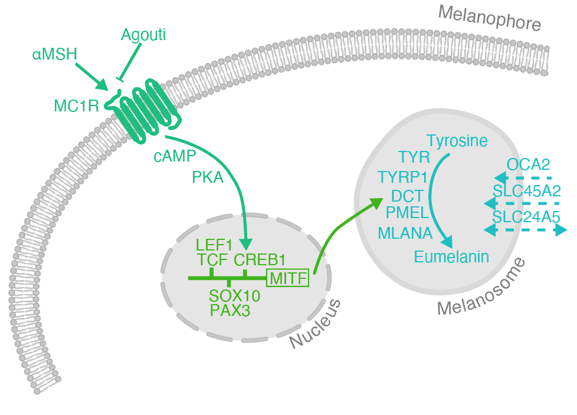

```{r setup, include=FALSE}
knitr::opts_chunk$set(echo = TRUE,
                      eval = FALSE,
                      message=FALSE,
                      error=FALSE,
                      fig.width=12,
                      fig.height=8)
knitr::opts_knit$set(root.dir = './')
library(webexercises)
```

#### Prepare environment

Let's load all the libraries we will use. A handy tool for loading packages is [pacman](http://trinker.github.io/pacman_dev/). This package conveniently loads libraries, installs libraries that are not installed, including bioconductor packages!

```{r eval=TRUE}
# install pacman if not already installed
if (!require("pacman")) install.packages("pacman")

# use pacman to load libraries
pacman::p_load(tidyverse,
               DESeq2,
               ggrepel,
               plotly)
```

## Background

We have seen that Spadefoot toad tadpoles have a developmentally fixed dorso-ventral gradient in pigmentation, and that tadpoles can increase or decrease their pigmentation based on the background they are raised on. We now want to explore what are the underlying genetic mechanism that are driving these changes in phenotype. Here, we will jump in around about the middle of a typical RNAseq workflow. We will have already done the following:

1.  Performed the experiment
2.  Extracted the RNA
3.  Sequenced the RNA
4.  Cleaned sequences and performed quality control
5.  Quantified sequences by mapping reads from each library onto our reference genome with [salmon](https://combine-lab.github.io/salmon/)
6.  Combined counts from all libraries into a single table using [tximport](https://bioconductor.org/packages/devel/bioc/vignettes/tximport/inst/doc/tximport.html). During this step, we have also calculated 'per-gene' counts. I.e. counts of multiple transcripts per gene have been summarized so that we are left with single estimates per gene.
7.  Minor data filtering to remove mtDNA, non-coding DNA and other irrelevant target sequences, to be left with only protein-coding genes

Our starting point will therefore be the count data for our RNAseq experiment prepared using tximport. In this exercise we will do the following:

1.  Load the RNAseq count data quantified with salmon and explore it.
2.  Visualize count data of biological replicates using a PCA
3.  Perform a differentially expressed genes analysis

## Load data

Lets load the count data:

```{r eval=TRUE}
txi<-readRDS("../data/salmon_gene_counts.rds")
str(txi)
```

For those of you unfamiliar, `.rds` files is a single R data object, created with `saveRDS()`. It is particularly useful for saving R objects that are not tabular, or more than 2-dimensional (e.g. lists, functions etc.).

## Exploring the loaded data

> *Question:* What does is the class and structure of this data object?

`r hide("Show Answer")`

```{r}
class(txi)
str(txi)
lapply(X=txi, FUN=head)
```

-   It is a list with 4 entries, three arrays/matrices (`abundamce`, `counts`, `length`) and 1 character vector (`countsFromAbundance`).

`r unhide()`

> *Question:* What is the content of this object and how is it arranged?

`r hide("Show Answer")` \* All three arrays have target transcripts as rows and biological samples per column. \* Counts: estimate of the number of reads mapping to each transcript. \* Abundance: Raw counts cannot be compared across samples because each library may vary slightly in terms of the total number of reads, differences in sequencing bias and difference in transcript lengths. Salmon (the program we used to quantify reads) also produces an array of "Abundances" which are normalized counts. According to the [salmon documention](https://salmon.readthedocs.io/en/latest/file_formats.html), this is Transcripts Per Million (TPM). This basically means that per sample, the total counts add up to 1 million. We could check this:

```{r}
apply(X=txi$abundance, FUN=sum, MARGIN = 2)
```

In this case, they don't quite add up to 1 million because I have already filtered this matrix, to remove non-coding and mitochondrial DNA.

-   length: effective length of the target transcript.
-   countsFromAbundance: a character vector indicating whether counts were taken directly from the quantifier (salmon) or whether they have been calculated from the abundances by `tximport`. Default is no (counts are from salmon).

`r unhide()`

I would argue that it is generally good practice to always plot the distributions of data. This is a good way to get to know your data and also to spot any potentially considerations we have give any analyses we may perform. Lets go ahead and plot the distributions of counts for each sample.

```{r}
txi$counts %>%
  as_tibble() %>% # turns matrix into tibble object class
  pivot_longer(everything(), names_to="sample", values_to="counts") %>% # turns wide table to long table
  mutate(counts=counts+1) %>% # we are going to plot on a log scale, so lets add 1 to each count so that log10(1) = 0
#  filter(counts>1) %>%
  ggplot(aes(counts)) +
  geom_histogram() +
  ylab("number of genes") +
  scale_x_log10() + # plot x-axis on a log scale
  facet_wrap(~sample) # facet each sample into its own plot
```

> *Question:* What do these distributions tell us about our count data?

`r hide("Show Answer")`

-   Many loci have 0 counts. Why might that be?
-   The distributions for all samples are similar.
-   The data is not normally distributed.

`r unhide()`

## Prefiltering

We will see later on that software for performing differential gene expression is quite good at dealing with non-normal, high zero-count data, but we can make our lives a little easier by removing at least those genes/loci that don't have any mapped reads.

```{r}
# find rownames where all counts == 0
keepers<-rownames(txi$counts)[rowSums(txi$counts)>0]
length(keepers)

# keep all those rows 
txi$counts<-txi$counts[keepers,]
txi$abundance<-txi$abundance[keepers,]
txi$length<-txi$length[keepers,]

#confirm rows have been dropped
dim(txi$counts)
```

## Adding biological/experimental meta data

To make any sort of inference, we need to add some additional information to the column names that tell us about the sample types and experimental conditions.

Let's load our design matrix. This is a .csv file where we have indicate which sample came from what treatment.

```{r}
samples<-read.csv("../data/experiment_data.csv")
samples
```

This tells us which specimens were subjected to which background colour. We can use some of our Tidyverse knowledge from the previous tutorial to now match this with the column names from the gene expression data.

```{r}
rna_samples<-tibble(
  sample_id=colnames(txi$counts),
  specimen_id=str_extract(sample_id, "\\d+") %>% as.numeric(),
  position=str_extract(sample_id, "[A-Z]")
) %>%
  left_join(samples)

rna_samples
```

> *Question:* How many repliactes do we have per tissue type per background?

`r hide("Show Answer")`

```{r}
rna_samples %>%
  group_by(position, background) %>%
  tally()
```

-   There are two tissues (dorsal and ventral skin) and two treatments (black and white). The treatments refer to the background colour that we raised the tadpoles in.
-   There are 3 replicates per tissue per background.

`r unhide()`

## Make a DESeqDataSet object

We can now combine the design matrix and the expression data into a format that DESeq2 likes. `tximport` plays very well with DESeq2, so this is easy!

```{r}
# double check column names are the same order
colnames(txi$counts)==rna_samples$sample_id

# make DESeq object
dds <- DESeqDataSetFromTximport(txi,
                         colData = rna_samples,
                         design = ~ position + background)
```

The dataset should have successfully been stored as a `DESeqDataSet` object. You should see that it has imported the `counts` and the `length` data from the `txi` object and the sample information from the design matrix. lets take a look at this object:

```{r}
dds
```

## Visualize your count data: PCA

First up, we may be curious as to whether there are some basic patterns in our data. For instance, we would expect biological replicates to cluster together based on their overall expression values. As it stands, we are dealing with a highly dimensional dataset though (each sample has \>30k 'variables') and so a dimensional reduction technique like a Principal Component analysis might be a good idea.

Before we go any further however, we need to do a better job at normalizing our count data, than just making counts relative to 1 million per sample. This includes:

1.  Normalizing counts *across* samples, so that we can compare them more accurately
2.  Normalize counts with respect to library/target size.

This second normalization may require a bit of explanation. You should recall that the `dds` object contains not only the counts, but also the transcript lengths.

```{r}
assay(dds, "avgTxLength") %>% head()
```

This shows that the different targets (i.e. the loci that the RNA-seq reads were mapped to) are of very different lengths. Logically, a larger target is expected to also receive more mapped reads! This can greatly impact our results and needs to be accounted for.

One technique to perform both of these normalizations is to use a `Variance Stabilising Transformation`. For this we need both the counts and the target lengths, and so conveniently, we can apply this directly to the `dds` object we have created.

```{r}
dds_vst<-vst(dds)
assay(dds_vst) %>% head()
```

We can now pass this transformed counts data to a canned PCA function. We are going to use our Tidyverse knowledge however, to make the plot a bit more informative.

```{r}
# standard DESeq2 PCA output top 500 most variable genes
plotPCA(dds_vst, intgroup=c("position", "background"), ntop=500)

# run PCA, but output the data, not the plot
pcaData<-plotPCA(dds_vst, intgroup=c("position", "background"), ntop=500, returnData=TRUE)

# extract percentage variance per PC axis
percentVar <- round(100 * attr(pcaData, "percentVar"))

# make a nice pca plot
ggplot(pcaData, aes(PC1, PC2, color=background, shape=position)) +
  geom_point(size=4) +
  xlab(paste0("PC1: ",percentVar[1],"% variance")) +
  ylab(paste0("PC2: ",percentVar[2],"% variance")) + 
  coord_fixed() +
  scale_color_manual(values=c("black","white"))+
  theme_dark() +
  ggtitle("PCA on 500 most variable genes")
```

> Question: Can we see any patterns in the PCA biplot?

`r hide("Show Answer")`

-   The first axis separates black from white background treatments
-   The second axis separates dorsal from ventral
-   The two axes explain almost the same amount of variance
-   There seems to be one dorsal sample that might be a potential outlier

`r unhide()`

## Differential Expression Analysis

The PCA can be useful to detect any outliers or spot potential problems with our data, but it is not an official statistical test. Our ultimate goal is to see if a given gene is expressed to a different degree in one condition vs. another condition. Ideally we want to do that for all genes at once, and this is the aim of a differential gene expression analysis. At it's core this sounds almost like a T-test kind of problem, but things are not that simple. In this exercise, I don't want to focus too much on the theory, but it is worthwhile to briefly discuss some of the "problematic" features of our data, that would make fitting a simple statistical model difficult. Some of this we have already seen.

-   Many counts are low, or even zero.
-   RNAseq data tends to exhibit overdispersion: the variance is much greater than the mean.
-   The target contigs (e.g. genes) are of different lengths. You would expect longer contigs to also have more mapped reads.
-   Each library (sample) consists of a different total number of reads.
-   RNAseq experiments tend to have few (usually three) replicates per condition.
-   There are typically thousands of genes, which means you are repeating the same pairwise test thousands of times.
-   Highly expressed genes tend to 'eat up' more reads during sequencing, meaning that genes that are less expressed tend to be underrepresented. This means changes in expression in highly expressed genes are easier to detect than changes in genes that are expressed at lower levels.

The differential expression analysis in `DESeq2` takes several steps to try to deal with these problems. At its core it fits generalized linear models with a negative binomial distribution to each gene. It takes into account the estimated counts per gene, normalized by library size, but also takes into account the size of the target genes/transcripts and a dispersion parameter. This dispersion parameter is calculated using all genes, even though the differential expression test is later fitted to only a single gene at a time.

It then performs a pairwise comparison of the level of expression per gene in condition A vs. condition B. It uses the models per gene to estimate coefficients and standard error for each sample group (i.e. for condition A and condition B). These coefficients are the estimates of log2 fold change.

To test whether this log2 fold change for a given gene is significant, it then applies a statistical test (Wald test), to test the hypothesis that the parameter (log 2 fold change) is significantly different from 0. A multiple test correction is then applied, by default a version of the Benjamini-Hochberg False Discovery Rate (FDR). This is done by ranking the genes by p-value, then:

$adjusted\ p\ value = p\ value * \frac{total\ number\ of\ tests}{rank}$

In short, `DESeq2` does the following:

1.  Estimation of size factors (control for differences in the library size of the sequencing experiments)
2.  Estimation of dispersion (e.g. for problem of large within-group variability and low sample sizes)
3.  Negative binomial GLM fitting (good for modeling discrete counts with over-dispersion)
4.  Wald statistics calculation and multiple testing correction (statistical significance testing)

These are all done with a single convenient function:

```{r}
dds <- DESeq(dds)
dds
```

> *Note: it looks like we are "overwriting" the `dds` object, but really, we are just adding more inforamtion to it*

This incredibly convenient function has done all of the heavy lifting for us, and it has even run some pair-wise tests already, based on the `~position + background` variables we set.

We can access the names of the pairwise tests like so:

```{r}
resultsNames(dds)
```

## Examining differential expression analysis results

We can extract the results for the pair-wise tests from the `dds` object like so:

```{r}
# dorsal versus ventral
res_pos<-results(dds, name = "position_V_vs_D")
res_pos

# black vs. white
res_bg<-results(dds, name = "background_white_vs_black")
res_bg
```

These tables have the following information:

1.  Rows are genes.
2.  Per gene, there are 6 metrics:

-   baseMean: the average of the normalized count values, dividing by size factors, taken over all samples (does not factor in gene lengths)
-   log2FoldChange: The effect size estimate. This value indicates how much the gene or transcript's expression seems to have changed between the comparison and control groups. This value is reported on a logarithmic scale to base 2.
-   lfcSE: The standard error estimate for the log2 fold change estimate
-   stat: The value of the test statistic for the gene or transcript.
-   pvalue: P-value of the test for the gene or transcript.
-   padj: Adjusted P-value for multiple testing for the gene or transcript.

> *Question:* Is there anything unexpected about the adjusted p-values?

`r hide("Show Answer")` Some of the adjusted p-values are `NA`. This is what the `DESeq2` handbook tells us:

"If a row is filtered by automatic independent filtering, for having a low mean normalized count, then only the adjusted p value will be set to NA. Description and customization of independent filtering is described below".

Let's check some of those counts with `NA` padj:

```{r}
counts(dds)[rownames(res_pos)[is.na(res_pos$padj)],] %>% head(15)
```

Indeed! all have very low counts!! they are therefore unreliable, and should rightfully not be included in the results. `r unhide()`

We can now summarize these results tables:

```{r}
summary(res_pos, alpha=0.05)
summary(res_bg, alpha=0.05)
```

This returns the number of up-regulated genes (LFC\>0) and down-regulated genes (LFC\<0) with respect to the control variable. Other information is also given, such as the number of outliers and low counts.

> *Question:* What do you notice about these results?

`r hide("Show Answer")`

-   There are more DEGs when comparing the dark versus light tadpoles than when comparing the dorsal versus ventral skin.

`r unhide()`

## Visualizing results

### Volcano plot

A plot resulting from a differential gene expression analysis that you may also have seen is a "Volcano" plot. These show the log fold change plotted against the adjusted p-values per gene. To make small p-values (padj) very large, the p-values are usually -log10() transformed. The most basic plot would look like this:

```{r}
res_pos %>%
  as_tibble(rownames = "gene_id") %>%
  ggplot(aes(x=log2FoldChange, y=-log10(padj))) +
  geom_point(alpha=0.75, shape=16) +
  ggtitle("Dorsum vs. Ventrum")
```

In such a plot, each dot represents a gene and the dots with positive fold changes (x-axis) are genes that are over expressed in the treatment versus the control and the genes with negative fold changes are those that are underexpressed. As in this case, we don't always have a clear control versus treatment set up, but DESeq2 will always take second contrast as the control. In our case this was the dorsal skin. This means that all genes on the left of 0 are over expressed in the dorsal skin and all genes to the right of 0 are over expressed in the ventral skin.

The degree of significance (adjusted p-value) is shown on the y-axis. This higher up genes are, the more significant their differential expression.

We can tweak this a little bit to highlight just those genes that are highly differentially expressed. Let's put a p-value threshold at \<0.05 and a log fold change threshold at \>2.

```{r}
res_pos %>%
  as_tibble(rownames = "gene_id") %>%
  drop_na(padj) %>% # drop all genes with NAs
  filter(padj<0.5) %>% # reduce the number of points that need to be plotted
  mutate(significant= padj<0.05 & abs(log2FoldChange)>=2) %>% # make a variable to indicate if a gene is significant based on a specific thresholds
  ggplot(aes(x=log2FoldChange, y=-log10(padj), color=significant)) +
  geom_point(alpha=0.75, shape=16) +
  ggtitle("Dorsum vs. Ventrum") +
  theme_bw()
```

Of course, now we would really like to know what those genes are! So far, we have been working with gene IDs that refer to identified transcripts/genes in the *Pelobates cultripes* genome assembly, but they have little real meaning to us. How to obtain annotations is a topic in itself and ideally would come from functional studies. However, such studies tend to only be very extensive for model systems and so we often rely in *homology*. I.e. we will assume that gene sequences with similar amino acid configurations will have similar functions. We can therefore use sequence similarity tools, like BLAST to map genes and their annotations from model organisms (in our case *Xenopus tropicalis*) onto our genome. Lets import these annotations.

```{r}
annotations<-read_csv("../data/annotations.csv")
annotations
```

> *Question:* Do all of our genes have homologous genes in *X. tropicals*? And are they all annotatated? What does this mean?

`r hide("Show Answer")`

```{r}
annotations %>%
  filter(is.na(xen_pep_id)) %>%
  nrow()

annotations %>%
  filter(is.na(xen_gene_symbol)) %>%
  nrow()

```

-   More than 200 *P.cultripes* loci did not match any loci in *X. tropicals*. Miss-assembly? 200 million years of independent evolution?
-   More than 5500 loci have no annotations. This is what is called the dark proteome (porteins with no defined 3D structure). It is estimated that 40-50% of the eukaryote proteome is dark!

`r unhide()`

Lets add these annotations to our plot. We could do this by adding text label to only our significant genes

```{r}
res_pos %>%
  as_tibble(rownames = "gene_id") %>%
  drop_na(padj) %>% # drop all genes with NAs
  filter(padj<0.5) %>% # reduce the number of points that need to be plotted
  mutate(significant= padj<0.05 & abs(log2FoldChange)>=2) %>% # make a variable to indicate if a gene is significant based on a specific thresholds
  left_join(annotations) %>% # pull across the extra columns, based on a "gene_id" match
  ggplot(aes(x=log2FoldChange, y=-log10(padj), color=significant, label=xen_gene_symbol)) +# add label text
  geom_point(alpha=0.75, shape=16) +
  geom_text(data= . %>% filter(significant)) + # add text labels for only the significant genes
  ggtitle("Dorsum vs. Ventrum") +
  theme_bw() +
  theme(legend.position="none")
```

This is a little messy. We could try and clean it up by having the text labels repel each other:

```{r}
res_pos %>%
  as_tibble(rownames = "gene_id") %>%
  drop_na(padj) %>% # drop all genes with NAs
  filter(padj<0.5) %>% # reduce the number of points that need to be plotted
  mutate(significant= padj<0.05 & abs(log2FoldChange)>=2) %>% # make a variable to indicate if a gene is significant based on a specific thresholds
  left_join(annotations) %>% # pull across the extra columns, based on a "gene_id" match
  ggplot(aes(x=log2FoldChange, y=-log10(padj), color=significant, label=xen_gene_symbol)) + 
  geom_point(alpha=0.75, shape=16) +
  geom_text_repel(data= . %>% filter(significant)) + 
  ggtitle("Dorsum vs. Ventrum") +
  theme_bw() +
  theme(legend.position="none")
```

This is already much better, but `geom_text_repel()` has decided to drop labels for points that are too close to each other. An interesting alternative is therefore to make this plot interactive, so that labels are only shown when we hover over points. This is easier to do than might think with the javascript package `plotly`.

```{r}
# save the plot as a ggplot object
p1<-res_pos %>%
  as_tibble(rownames = "gene_id") %>%
  drop_na(padj) %>% # drop all genes with NAs
  filter(padj<0.5) %>% # reduce the number of points that need to be plotted
  mutate(significant= padj<0.05 & abs(log2FoldChange)>=2) %>% # make a variable to indicate if a gene is significant based on a specific thresholds
  left_join(annotations) %>% # pull across the extra columns, based on a "gene_id" match
  ggplot(aes(x=log2FoldChange, y=-log10(padj), color=significant, label=xen_gene_symbol)) + 
  geom_point(alpha=0.75, shape=16) +
  ggtitle("Dorsum vs. Ventrum") +
  theme_bw() +
  theme(legend.position="none")

# convert the ggplot to a plotly object
ggplotly(p1, tooltip = "label") # define the "label" aesthetic as the hover text
```

To get back to our story at hand though, lets make one final plot, where we show volcanoes for both comparisons (dorsal versus ventral and black versus white), and lets add only those annotations that are related to the photosensitive melanin synthesis pathways.

```{r}
# load a reduced annotation file 
melanin_genes<-read_csv("../data/melanin_genes.csv")
melanin_genes

# combine the two DESeq results tables
res<-bind_rows(res_pos %>%
                 as_tibble(rownames="gene_id") %>%
                 mutate(contrast="Dorsal vs. Ventral"),
               res_bg %>%
                 as_tibble(rownames="gene_id") %>%
                 mutate(contrast="Black vs. White"))
# plot
res %>%
  drop_na(padj) %>% 
#  filter(padj<0.5) %>% 
  mutate(sig= padj<0.05) %>% # lets be a bit more relaxed and not put a threshold on the fold change 
  left_join(melanin_genes) %>%
  ggplot(aes(x=log2FoldChange, y=-log10(padj), color=sig, label=gene_symbol)) +
  geom_point(alpha=0.75, shape=16) +
  geom_text_repel(max.overlaps = Inf) + # set the maximum overlap to infinity, to show all labels.
  xlim(-15,15) + # fix axis width
  facet_wrap(~contrast) + # facet based on contrast
  theme_minimal() +
  scale_color_manual(values=c("grey","black")) +
  theme(legend.position = "none")
```

Lets look at our gene pathway schematics again and discuss the results.



> *Question:* What genes from these pathways did we recover and are they expressed in a way that we expect?

`r hide("Show Answer")`

-   For both contrasts, the darker phenotype shows overexpression of genes related to tyrosine metabolism
-   asip expressed in ventral skin seems to shut down the whole pathway
-   mc1r and the master regulator genes are expressed in the light-exposed contrast, not necessarily the melanized contrast. There seems to be a decoupling of this receptor and downstream regulators to allow for effective crypsis via background matching

`r unhide()`

### Reaction Norms

As a last bonus, to match our phenotype plots, we can also show our expression data as reaction norms. For this, we can use the normalized expression values from the VST matrix.

```{r}
assay(dds_vst) %>%
  as_tibble(rownames="gene_id") %>%
  left_join(melanin_genes) %>% # add annotations
  drop_na(gene_symbol) %>% # keep only genes with annotations
  select(gene_id, gene_symbol, where(is.numeric)) %>%
  pivot_longer(-c(gene_id, gene_symbol), names_to="sample_id", values_to = "expression") %>%
  left_join(rna_samples) %>% # pull in experimental info about samples
  # instead of calculating means and standard deviations, we will use the stat_summary() layer from ggplot to calculate these on the fly.
  ggplot(aes(x=position, y=expression, color=background)) +
  stat_summary(aes(group = background), fun = mean, geom = "path") +
  stat_summary(aes(color = background), fun.data = mean_cl_boot, geom = "errorbar", width = 0.1) +
  stat_summary(aes(color = background), fun= mean, geom = "point", size = 2) +
  scale_color_manual(values = c("black"="black","white"="grey80")) +
  facet_wrap(~gene_symbol) +
  theme_bw() +
  theme(panel.grid.major = element_blank(), panel.grid.minor = element_blank()) # remove grid lines
```
